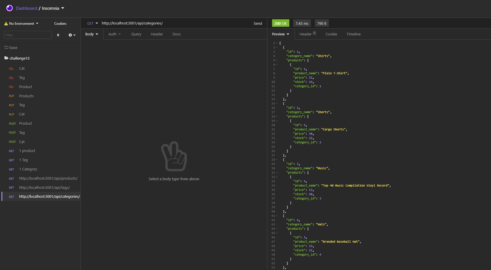

# inventory-server-sql

## License

No License Provided

## Table of Contents

 * [Installation](#installation)
 * [Usage](#usage)
 * [Credits](#credits)
 * [License](#license)
 
## Description
[Click this link to view it in action](https://github.com/AdamR-Work/inventory-server-sql)

It uses mysql, node, dotenv, sequelize to help mananage a servers database that sells clothing items.

## Usage

Sequelize helped to transverse the mysql and node packages to make it easy to  update the database. 

## Installation

>node install sequelize mysql2 dotenv

## Languages

JavaScript ,Node 

## Questions

### AdamR-Work

https://github.com/AdamR-Work/inventory-server-sql

## Contributing

## Tests

>none

## Credits

